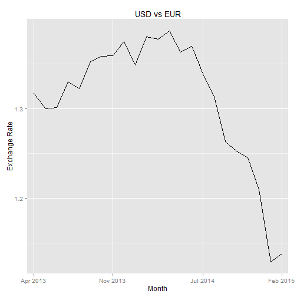

## The Problem
<br />

* People all over the world use many different currencies in their daily lives.
* It can often be confusing to convert from one to the other.
* Incorrectly converting from one currency to the other can lead to serious headaches.


```r
16.25 * 1.14 # = ??? 
```

```
## [1] 18.52
```

---

## The Solution
<br />

Our Data Product will ensure that you never again have trouble converting currencies from around the world.

Features

* Easy to use input
* Reactive design
* Useful exchange rate graph

---

## Example

 

---

## Questions and Feedback?
<br />

If you have any questions, comments or feedback, please feel free to email me at zachf1989@gmail.com

Thank you for your time.
